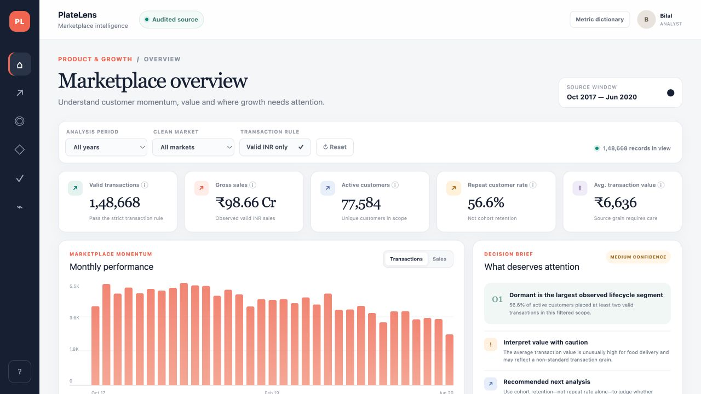
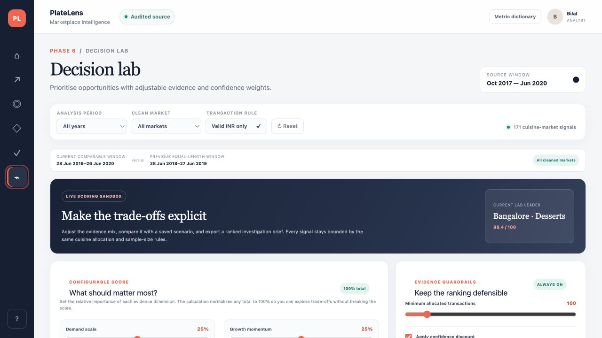
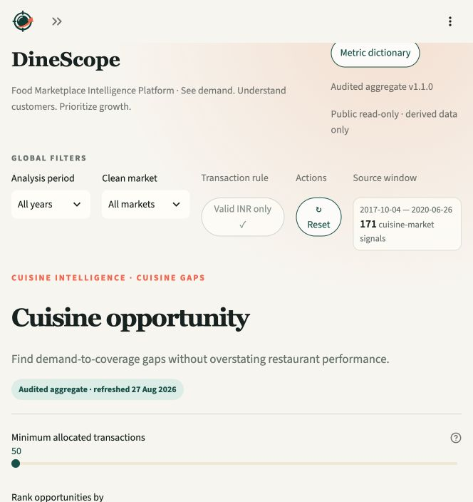

  

<h1 align="center">DineScope — Food Marketplace Intelligence</h1>

<strong>See demand. Understand customers. Prioritize growth.</strong>

  
  
  
  

  <a href="https://dinescope-marketplace-intelligence.streamlit.app/">Open the public app</a> ·
  <a href="https://dinescope-marketplace-intelligence.streamlit.app/?embed=true">Open the anonymous embed view</a> ·
  <a href="./STATUS.md">Read the implementation status</a>

**DineScope** is a Food Marketplace Intelligence Platform: an interactive decision-intelligence product that helps Product and Growth teams uncover customer, market, restaurant, and cuisine opportunities from food-delivery data. It turns a messy marketplace export into a connected workflow for understanding customer behaviour, market demand, cuisine opportunity and data reliability—then makes the evidence boundary visible before a team acts on a ranking.

This is an independent portfolio case study built from a public or synthetic food-delivery dataset. It is not affiliated with, endorsed by, or based on internal data from Zomato, Swiggy or another food-delivery company.

## Recruiter quick read

| | What DineScope demonstrates |
|---|---|
| **Product problem** | Marketplace teams need to decide where to investigate next, but growth, demand, supply and data quality signals rarely share one trustworthy frame. |
| **Primary users** | Product and Growth first; Marketplace, Category and City Operations as adjacent decision partners. |
| **Product outcome** | A decision-ready analytics workspace that separates observed facts, assumptions and hypotheses instead of turning weak evidence into false precision. |
| **My contribution in this case study** | Product framing, metric definitions, data-quality contract, reproducible analytics pipeline, UX architecture, Streamlit implementation, React/TypeScript reference experience, testing and public deployment. |
| **Current status** | Six aggregate-only Streamlit workspaces are live from GitHub <code>main</code>; the private React/Vinext experience remains the richer visual reference. |

### Why this is more than a dashboard

- **Decision-led:** every surface answers a product or marketplace question, not just “what can be plotted?”
- **Trust-aware:** validity rules, denominators, comparison windows, coverage and confidence are shown alongside the metric.
- **End-to-end:** the repository includes the data contract, transformation pipeline, typed metric layer, UI, tests and deployment configuration.
- **Responsible:** rankings are framed as investigation signals; the product does not invent delivery, cancellation, discount, commission, funnel or campaign metrics that the source cannot support.

## Product surface

The public Streamlit app has six connected workspaces. The **Customer Growth** workspace is the first working analytics module; the other surfaces extend the same audited aggregate and filter contract.

| Workspace | What a team can do | Key outputs |
|---|---|---|
| **Overview** | Establish the marketplace baseline and identify the next evidence question. | Five audited KPIs, monthly Transactions/Sales toggle, deterministic decision brief, top source markets, lifecycle mix and reliability hand-off. |
| **Customer growth** | Separate acquisition volume, repeat behaviour and actual cohort return. | Active/New/Repeat metrics, acquisition-versus-return trend, transaction frequency, lifecycle segmentation, M0–M6 cohort-retention table and segment evidence CSV. |
| **Market demand** | Compare meaningful market scale and momentum without letting tiny bases lead. | Reviewed metro mapping, equal-length comparison windows, eligibility thresholds, confidence labels, scale × momentum quadrant, monthly pulse, ranked evidence table and CSV. |
| **Cuisine gaps** | Find cuisine-market pairs worth validating while keeping supply evidence conservative. | Canonical taxonomy, additive 1/n cuisine allocation, opportunity score, demand heatmap, selected diagnostics, observed-listing context, evidence thresholds and CSV. |
| **Data reliability** | Check whether a metric deserves to influence a decision. | Raw-versus-valid reconciliation, valid transaction rate, rating/menu/restaurant coverage, schema integrity, source fingerprint, checksum and issue treatment register. |
| **Decision Lab** | Make prioritisation trade-offs explicit and compare scenarios. | Demand/growth/reach/gap/quality weights, confidence discounting, evidence guardrails, session-only presets, leader comparison, rank movement and metadata-rich decision brief export. |

## Evidence snapshot

The published aggregate is generated from **150,281 source rows** and an audited **36-column contract**. These are the headline values exposed by the product:

| Evidence | Verified value | How DineScope treats it |
|---|---:|---|
| Valid transactions | **148,668** | Only distinct orders that pass the explicit validity rule enter business KPIs. |
| Excluded transactions | **1,613** | Exclusions remain visible and reconcile to the raw denominator; they are not silently dropped. |
| Gross valid sales | **₹986,564,268** | Reported as gross valid INR sales, not net revenue or company financial reporting. |
| Active customers | **77,584** | Distinct customers with at least one valid transaction in the selected scope. |
| Repeat customer rate | **56.6%** | Customers with two or more valid transactions in scope; explicitly not cohort retention. |
| Rating coverage | **41.0%** | An evidence-availability measure shown beside interpretation, not a quality score. |
| Menu coverage | **8.1%** | A deliberately visible limitation on menu-based supply comparisons. |
| Raw market labels | **822** | Locality labels are mapped to reviewed metro labels with Unknown retained. |
| Cuisine coverage | **98.9%** | Multi-cuisine demand is allocated proportionally so covered demand remains additive. |
| Repeated restaurant IDs | **123 of 148,541** | Restaurant evidence is presented as observed listings, not durable outlet performance. |

The observed source window is **4 October 2017 through 26 June 2020**. Dates are parsed as <code>MM/DD/YYYY</code>; duplicate order IDs and invalid dates are zero in the audited source.

## Product decisions and trade-offs

### Repeat behaviour is not retention

Repeat rate answers “what share of active customers ordered at least twice in this scope?” Cohort retention answers “what share of a first-observed cohort returned at month age *m*?” DineScope keeps both visible so a large repeat number cannot be presented as proof that acquisition is compounding.

### Evidence thresholds come before opportunity rankings

Market growth uses equal-length current and comparison windows with minimum samples. Cuisine-market opportunities require at least 100 allocated current transactions and 50 allocated comparison transactions by default. Smaller bases remain explorable, but they cannot lead the default evidence queue.

### Multi-cuisine demand is additive by design

If a transaction lists <code>n</code> unique canonical cuisines, each cuisine receives an equal <code>1/n</code> share of the transaction and sales value. Allocated demand therefore reconciles exactly to cuisine-covered valid transactions. This is a directional planning assumption, not item-level revenue attribution.

### Restaurant identity is deliberately conservative

Normalization standardizes accents, case, punctuation and ampersands without fuzzy matching or stripping outlet locations. Because restaurant IDs rarely repeat, the product reports observed normalized listings and coverage context rather than claiming restaurant-level performance.

### Unsupported operations metrics stay out of scope

The source has no delivery-time, cancellation, discount, commission, funnel or campaign fields. DineScope does not fabricate those measures; a new source contract would be required before adding them.

## Technical architecture

~~~text
Local source CSV (never committed)
        │
        ▼
Python schema gate + validity audit + deterministic mappings
        │
        ▼
Deployment-safe aggregate JSON (contract v1.1.0)
        ├── Python metric adapter ──► public Streamlit Community Cloud app
        └── TypeScript metric/filter layer ──► private React/Vinext reference UI
~~~

The Streamlit runtime reads only <code>app/data/analytics.json</code>. It does not query, ship or provide downloads of raw customer/order records. Reviewable location, cuisine and conservative restaurant-name mappings are committed separately so normalization decisions can be inspected.

### Data pipeline

1. Validate the source has the required fields and exactly 36 columns.
2. Parse <code>MM/DD/YYYY</code> dates and apply the valid INR transaction rule.
3. Preserve raw-row quality counts, exclusions, source fingerprint and definitions.
4. Normalize locations, cuisines and restaurant names through explicit, reviewable rules.
5. Build customer, market, cuisine, reliability and Decision Lab aggregates.
6. Write the deployment-safe JSON plus mapping CSVs consumed by the app.

## Tech stack

| Layer | Technology | Purpose |
|---|---|---|
| Public product | **Python 3.11, Streamlit 1.62.0** | Public read-only analytics experience and deployment entry point (<code>streamlit_app.py</code>). |
| Analytics adapter | **pandas 2.2.3, NumPy 2.2.6, Altair 6.2.2** | Deterministic frames, scoring helpers, tables and interactive charts. |
| Reference product | **React 19, TypeScript 5.9, Vinext, Vite** | Polished typed reference experience with the richer private-site interaction model. |
| Build/deployment compatibility | **Cloudflare Workers/Sites tooling** | Keeps the reference interface compatible with the existing private Sites deployment. |
| Test tooling | **Python <code>unittest</code>, Node test runner, ESLint 9** | Analytics contracts, UI interaction contracts, accessibility checks and regression tests. |
| Hosting | **Streamlit Community Cloud + GitHub <code>main</code>** | Public Streamlit deployment with Python 3.11 and pinned dependencies. |

## Run locally

### Public Streamlit experience

~~~bash
python3.11 -m venv .venv
.venv/bin/pip install -r requirements.txt
.venv/bin/streamlit run streamlit_app.py
~~~

Open the local URL printed by Streamlit. The app defaults to all known feature flags. To stage a subset during validation:

~~~bash
DINESCOPE_FEATURE_FLAGS=shell_v2,markets_v2 .venv/bin/streamlit run streamlit_app.py
~~~

### React/Vinext reference experience

~~~bash
npm install
npm run dev
~~~

The reference interface supports the optional local role hook <code>DINESCOPE_ADMIN_EMAILS</code>. Unauthenticated local previews resolve to <code>Preview</code>; authenticated visitors resolve to <code>Analyst</code> unless their email is in the Admin allowlist.

### Rebuild the audited aggregate locally

The raw CSV is intentionally local and ignored by Git. The default mapping outputs are written to <code>data/mappings/</code>.

~~~bash
.venv/bin/python scripts/audit_source.py /path/to/zomato_business_complete.csv
.venv/bin/python scripts/build_analytics.py /path/to/zomato_business_complete.csv app/data/analytics.json
~~~

The builder fails before processing when required fields are missing or the source does not match the audited schema. Never place the raw CSV, customer-level extracts or secrets in the public repository.

## Verification and quality gates

The release is covered by both pure analytics tests and rendered Streamlit checks:

~~~bash
# Python analytics + Streamlit AppTest suite
.venv/bin/python -m unittest discover -s tests -p 'test_*.py'

# React/reference analytics and interaction contracts
npm test

# Static quality and reference build checks
npm run lint
npm run build
npm run check:performance
~~~

The latest release validation passed **24 Python tests**, **16 Node tests**, ESLint and <code>git diff --check</code>. The local Streamlit AppTest suite covers all six workspaces, while the Streamlit Cloud smoke test rendered the public shell and exercised the live Decision Lab. Engineering budgets guard against regressions in the aggregate payload (1.3 MB), client JavaScript (650 KB raw / 180 KB gzip sum) and client CSS (60 KB raw / 20 KB gzip sum).

## Deployment and release boundary

- **Repository:** [Bilal-03/dinescope-marketplace-intelligence](https://github.com/Bilal-03/dinescope-marketplace-intelligence)
- **Branch:** <code>main</code>
- **Streamlit entry point:** <code>streamlit_app.py</code>
- **Runtime:** Python 3.11 with dependencies pinned in <code>requirements.txt</code>
- **Visibility:** Streamlit Cloud app is public and searchable; the runtime is read-only and aggregate-only.
- **Release flow:** push to <code>main</code> → Streamlit Community Cloud pulls the repository → dependency and app smoke checks run in the hosted environment.

Public artifacts are limited to:

- <code>app/data/analytics.json</code> — derived aggregate contract v1.1.0.
- <code>data/mappings/*.csv</code> — reviewable location, cuisine and restaurant-name mappings.
- <code>docs/screenshots/*</code> — aggregate-only product captures.

The raw source CSV, customer/order records, <code>.streamlit/secrets.toml</code>, credentials, tokens and private Sites metadata are excluded. See [docs/public_data_boundary.md](./docs/public_data_boundary.md) and [docs/release_readiness.md](./docs/release_readiness.md) for the recorded release gate.

## Five-minute portfolio walkthrough

1. Open the [live Streamlit app](https://dinescope-marketplace-intelligence.streamlit.app/).
2. Start in **Overview** to see the audited KPI baseline and the deterministic decision brief.
3. Open **Customer growth** to inspect the acquisition-versus-return view and M0–M6 cohort retention—the clearest example of product metric discipline.
4. Open **Cuisine gaps** or **Market demand** to see evidence thresholds, confidence and mapping context beside opportunity signals.
5. Open **Decision lab** to change the five weights, compare the leader and inspect rank movement.
6. Open **Metric dictionary** or **Data reliability** to see how the source contract limits interpretation.

Representative captures are available in [docs/screenshots/](./docs/screenshots/):

  
  
  

## Repository map

~~~text
streamlit_app.py                 Public Streamlit application and workspace rendering
streamlit_lib.py                 Pure metric, eligibility and Decision Lab helpers
app/data/analytics.json          Audited deployment-safe aggregate
app/lib/analytics.ts             Typed metric/filter layer for the reference UI
app/components/dashboard.tsx     React/Vinext reference dashboard
scripts/audit_source.py          Read-only source profiling
scripts/build_analytics.py       Reproducible aggregate + mapping builder
tests/                            Python AppTest and Node analytics/interface contracts
data/mappings/                    Reviewable location, cuisine and restaurant mappings
docs/methodology.md               Definitions, assumptions and evidence boundaries
docs/metric_dictionary.md         Metric formulas, grain and limitations
docs/release_readiness.md         Public-release decision and acceptance gate
docs/streamlit_public_deployment_plan.md
                                  Streamlit implementation and rollout plan
STATUS.md                         Phase checklist and next build order
~~~

## Roadmap and explicit non-goals

The public baseline is complete through Streamlit Phases 0–5. The next optional capability is **server-backed team sharing for saved Decision Lab scenarios**. It is deliberately not enabled yet because durable collaboration needs a persistence model, authorization policy, versioning and audit trail.

The following remain intentionally out of scope until a stronger source is available:

- causal lift, forecasts, profitability or incremental-market claims;
- delivery operations, cancellation, discount, commission, funnel or campaign analytics;
- durable restaurant-level performance when restaurant IDs rarely repeat;
- demographic targeting recommendations from descriptive source fields.

## Further reading

- [STATUS.md](./STATUS.md) — phase-by-phase implementation checklist.
- [docs/portfolio_case_study.md](./docs/portfolio_case_study.md) — product narrative and portfolio framing.
- [docs/methodology.md](./docs/methodology.md) — source contract, formulas and assumptions.
- [docs/metric_dictionary.md](./docs/metric_dictionary.md) — metric definitions by grain and limitation.
- [docs/release_readiness.md](./docs/release_readiness.md) — deployment and public-release gate.
- [docs/public_data_boundary.md](./docs/public_data_boundary.md) — approved public artifacts and exclusions.
- [docs/streamlit_public_deployment_plan.md](./docs/streamlit_public_deployment_plan.md) — Streamlit parity and rollout plan.

---

**DineScope in one sentence:** a deployment-ready marketplace intelligence product that makes customer growth, demand opportunity and data reliability legible in one workflow—without pretending the data proves more than it does.
